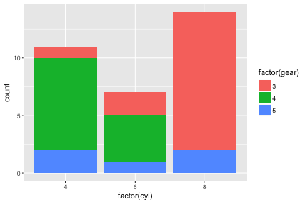
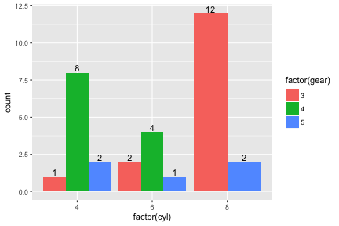
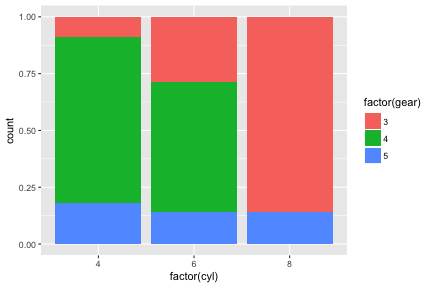
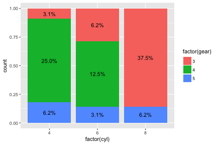

In this vignette, you will learn how to add labels to bar plots representing counts. Labelling bar plots representing values will be coverd in the next vignette. You can add labels using geom_text() function. If you want to add labels to the proportional bar plots, you have to make some manipulation of your data.


# Bar plot representing count

## Stacked bar plot 

The default `position` of the geom_bar() function is `stack` and the default stat is `count`. You can make bar plot with geom_bar(stat="count"). This is identical with stat_count(geom="bar").


```r
ggplot(mtcars,aes(x=factor(cyl),fill=factor(gear)))+geom_bar(stat="count")
```


```r
ggplot(mtcars,aes(x=factor(cyl),fill=factor(gear)))+stat_count(geom="bar")
```



You can add labels to bar plot using geom_text(). You can add labels represneting counts with the following code. The geom_text() needs x,y and label. 


```r
ggplot(mtcars,aes(x=factor(cyl),fill=factor(gear)))+
    geom_bar()+
    geom_text(aes(label=..count..),stat="count",position=position_stack())
```


If you want to put the label in the middle of each bar, set the `vjust` argument of position_stack() function to `0.5`.


```r
ggplot(mtcars,aes(x=factor(cyl),fill=factor(gear)))+
    geom_bar()+
    geom_text(aes(label=..count..),stat="count",position=position_stack(0.5))
```


## labelling stacked barplot with ggplotAssist

### Mapping the variables

Launch ggplotAssist add-in. Check the data name(1). After select the `as factor` checkbox(2), select `x` and `factor(cyl)` to map the x-axis variable(not shown). Select `fill`(3) and `factor(gear)`(arrow) to map the fill variable. 


### Add geom_bar() layer

Select `geom` button(4). Select `geom_bar`(5) among selections. Check the R code for the layer(6) and plot preview in the lower right corner. Press `Add Layer` button(7).


### Add geom_text() layer - standard method

Select `geom_text`(8) among geoms. To map label, select `mapping` radioButton(9). Select `label` among aes(10) and select ..count.. among var(11). Select `count` as stat(12). Select `position_stack()` as position(13) and set vjust 0.5(14). Check the resultant R code for layer(15) and plot preview at lower right corner. Press `Add Layer` button(16).    


### Add geom_text() layer - A shortcut

I have made a shortcut in the ggplotAssist app. After adding the geom_bar() layer, select `geom_text`(8) among geoms. Press `Add Bar Label` button(9). The R code for labelling bar plot is made(10). Adjust vjust argument(11).  


## Grouped Bar plot

You can make a grouped bar plot by setting the position of geom_bar() to `dodge`.


```r
ggplot(mtcars,aes(x=factor(cyl),fill=factor(gear)))+
    geom_bar(position="dodge")
```


You can label the bar plot with geom_text() function.


```r
ggplot(mtcars,aes(x=factor(cyl),fill=factor(gear)))+
    geom_bar(position="dodge")+
    geom_text(aes(label=..count..),stat='count',position=position_dodge(0.9))
```


For fine adjustment of vertical position of label, you can adjust vjust argument of geom_text().


```r
ggplot(mtcars,aes(x=factor(cyl),fill=factor(gear)))+
    geom_bar(position="dodge")+
    geom_text(aes(label=..count..),stat='count',position=position_dodge(0.9),vjust=-0.2)
```



## labelling grouped barplot with ggplotAssist

### Make a grouped barplot

After mapping the x-axis and fill variables, select `geom_bar` among geoms(1). Set the position `dodge`(2). You can see the R code for layer(3). Press `Add Layer` button(4).


### Add label

Select `geom_text`(5) among geoms. Press `Add Bar Label` button(6). Set the width argument of position_dodge 0.9(7). You can see the R code for this layer(8). Press `Add Layer` button(9).


## Proportional stacked bar plot

You can make a proportional atacked bar plot by setting the position of geom_bar() `fill`.


```r
ggplot(mtcars,aes(x=factor(cyl),fill=factor(gear)))+
    geom_bar(position="fill")
```



You can label the bar plot with counts with geom_text() function.


```r
ggplot(mtcars,aes(x=factor(cyl),fill=factor(gear)))+
    geom_bar(position="fill")+
    geom_text(aes(label=..count..),stat='count',position=position_fill(vjust=0.5))
```


You can to make labels with ratios instead of counts with the following code.


```r
ggplot(mtcars,aes(x=factor(cyl),fill=factor(gear)))+
    geom_bar(position="fill")+
    geom_text(aes(label=scales::percent(..count../sum(..count..))),
              stat='count',position=position_fill(vjust=0.5))
```



To add labels with columnwise ratios, the first thing to do is to make another data summarizing columnwise ratio.


```r
percentData <- mtcars %>% group_by(cyl) %>% count(gear) %>%
    mutate(ratio=scales::percent(n/sum(n)))
percentData
```

```
# A tibble: 8 x 4
# Groups:   cyl [3]
    cyl  gear     n ratio
  <dbl> <dbl> <int> <chr>
1     4     3     1  9.1%
2     4     4     8 72.7%
3     4     5     2 18.2%
4     6     3     2 28.6%
5     6     4     4 57.1%
6     6     5     1 14.3%
7     8     3    12 85.7%
8     8     5     2 14.3%
```

With this data, make a label with geom_text() function.


```r
ggplot(mtcars,aes(x=factor(cyl),fill=factor(gear)))+
    geom_bar(position="fill")+
    geom_text(data=percentData, aes(y=n,label=ratio),
              position=position_fill(vjust=0.5))
```


## Labelling a proportional stacked barplot with ggplotAssist

### Make a proportional stacked barplot

After mapping the x-axis and fill variables, select `geom_bar` among geoms(1). Set the position `fill`(2). You can see the R code for layer(3). Press `Add Layer` button(4).


### Add label

Select `geom_text`(5) among geoms. Press `Add Bar Label` button(6). A new data summarizing columnwise ratio is made automatically and inserted as preprocessing(7). With this data, the R code for this layer is made(8). Set the vjust argument of position_fill() 0.5(9). Press `Add Layer` button and you can get the plot.


